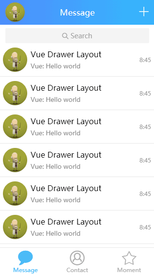

# vue-drawer-layout
[](https://www.npmjs.org/package/vue-drawer-layout)
[](https://www.npmjs.org/package/vue-drawer-layout)
[](https://travis-ci.org/hjl19911127/vue-drawer-layout)
[](https://codecov.io/gh/hjl19911127/vue-drawer-layout)
[](https://www.npmjs.org/package/vue-drawer-layout)
> 一个简单的DrawerLayout（抽屉组件 / 侧滑菜单）布局组件，基于[Vue.js](http://vuejs.org)

[English Doc](README.md)

## 示例

[http://share.codehuang.com/vue-drawer-layout](http://share.codehuang.com/vue-drawer-layout)

[QQ APP 的抽屉效果（点我或扫下面的二维码）](http://chat.codehuang.com/message)


点击页面中左上角的头像打开drawer或者向右向左拖拽



如果图片没有动画, 说明你的浏览器不支持`APNG`, 点[示例](assets/demo.gif)查看GIF的动图

## 依赖
* [Vue.js](http://vuejs.org) (2.x)

## 浏览器兼容性
现代（移动）浏览器或IE10+（支持css transition api），X5内核也经过测试

## 安装

```bash
npm install vue-drawer-layout --save
```

## 使用

*下面的例子也可以使用CommonJS规范引入*
```js
import Vue from 'vue'
import DrawerLayout from 'vue-drawer-layout'

Vue.use(DrawerLayout)
// or
import {DrawerLayout} from 'vue-drawer-layout'
Vue.component(DrawerLayout.name, DrawerLayout)
```
你可以什么属性也不传，或者只设置`drawer-width`属性就能得到一个简单的drawer（像Android原生的drawerLayout那样drawer在上面）
```html
<vue-drawer-layout ref="drawer" :drawer-width="800">
  <div class="drawer-content" slot="drawer">
    <!-- drawer-content -->
  </div>
  <div slot="content">
    <!-- main-content -->
  </div>
</vue-drawer-layout>
```
或者你可以设置所有属性来得到一个更惊艳的drawer，想移动QQ那样（drawer从主容器下方出现，且移动的距离只有总宽度的1/3）

```html
<vue-drawer-layout
  ref="drawer"
  :drawer-width="800"
  :enable="true"
  :animatable="true"
  :z-index="0"
  :drawable-distance="Math.floor(800/3)"
  :content-drawable="true"
  :backdrop="true"
  :backdrop-opacity-range="[0,0.4]"
  @slide-start="handleSlideStart"
  @slide-move="handleSlideMove"
  @slide-end="handleSlideEnd"
  @mask-click="handleMaskClick">
    <div class="drawer-content" slot="drawer">
      <!-- drawer-content -->
    </div>
    <div slot="content">
      <!-- main-content -->
    </div>
</vue-drawer-layout>
```

## API

### Props

| 名称 | 介绍 | 类型 | 默认值 |
|-----------|-----------|-----------|-------------|
| drawer-width | drawer的宽度(px) | `Number` | 父容器宽度的80% |
| drawable-distance | drawer可拖拽的最大距离(px) | `Number` | 与`drawer-width` 属性一样 |
| z-index | drawer的z-index | `Number` | `818`（不要问我为什么^_^） |
| content-drawable | 主容器是否一起移动 | `Boolean` | `false` |
| backdrop | 是否显示蒙层 | `Boolean` | `true` |
| backdrop-opacity-range | 蒙层的透明度范围[min,max] | `Array` | `[0,0.4]` |
| enable | 启用禁用drawer功能 | `Boolean` | `true` |
| animatable | drawer移动过程是否有动画 | `Boolean` | `true` |
| reverse | drawer从右侧滑出 | `Boolean` | `false` |

### Slots

| 名称 | 介绍 | 
|-----------|-----------|
| drawer | drawer内嵌内容 |
| content | 主容器内嵌内容 |

### Methods

| 名称 | 介绍 | 参数 | 使用方式 |
|-----------|-----------|-----------|-----------|
| toggle | 显示或者隐藏drawer | `visible(Boolean)` | `toggle(true/false)` 或者 `toggle()`切换显示隐藏 |

### Events

| 名称 | 介绍 | 回调参数 |
|-----------|-----------|-----------|
| slide-start | drawer开始拖拽前（touchstart 触发） | - |
| slide-move | drawer拖拽中（touchmove 触发） | `pos(int)` |
| slide-end | drawer拖拽结束（touchend 有动画则是transitionend事件之后触发） | `visible(boolean)` |
| mask-click | 蒙层点击事件  | - |

## 许可证
[MIT License](LICENSE).

Copyright (c) 2018 Alexander Huang.
